# Java English Learning Application

## I. INTRODUCTION

* This is English learning application programmed and developed by a group of 3 students at the University of
  Engineering and Technology for a project for **Object - Oriented Programming Course**.
* This is English learning application written in Java language combined with Javafx and CSS. This is the first version
  of this one and there will be further developments in the future.
* The current version has about 100.000 vocabulary words, each vocabulary will include both English and Vietnamese
  meanings, and users can add words themselves.

## III. PROJECT DESCRIPTION

### 1. Basic features

For the current version of the application, we will have the following functions

* Search: You can search for an English word to see its Vietnamese meaning, or see its word types You just need to enter
  the word in the search bar and the bottom will suggest words for you. Click on the word you need to know the meaning
  of and view it.
* Translate online: When you need to translate the meaning of many words or a paragraph, you can use the Google
  Translate function on this application. You choose the language you want to translate and enter the text you need to
  translate into the box, press the button to start translating.
* Save word: With this function, you can add words you need to use later to your favorites list for convenient review.
* History: This function saves the words you have looked up and displays them as a list.
* Add to dict: Additionally, you can also add the word you want to the dictionary with the "add to dict" function. With
  this function you can add a word and its meaning to the dictionary if that word does not appear in the dictionary.
* Edit word: When you see that the meaning of a word in the dictionary is incorrect or you want to add a meaning to a
  certain word, or even delete that word, the edit function will help you do this.
* Listen to pronunciation: You can listen to pronunciation to improve your speaking and pronunciation with 2 speaking
  methods: **US** and **UK**
* Game: Finally, you can practice your vocabulary with the games below
    * Shuffle game: This game will choose a random word in dictionary and arrange it in any order. Your action is to
      rewrite the word correctly. The game will record your consecutive correct sequence.
    * Guess game: This game will show you 1 image and 4 answers below. Your job is to choose the answer with a
      meaningful word that represents the picture. And like the game above, this game will also record your longest of
      correct answers.

### 2. Installation

- Download and install [IntelliJ IDEA](https://www.jetbrains.com/idea/download) (either _Community Edition_ or _Ultimate Edition_ will work)
- Open IntelliJ IDEA and create a development environment
  - Click on _Projects > Get from VCS_
  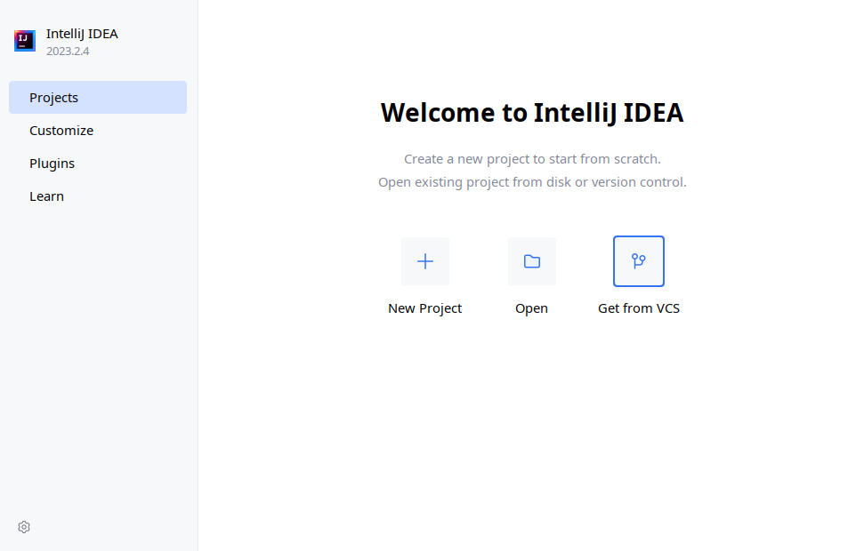
  - Paste the [repository URL](https://github.com/cdf144/english-learning-app.git) into the _URL_ field and click _Clone_ in the bottom right corner
  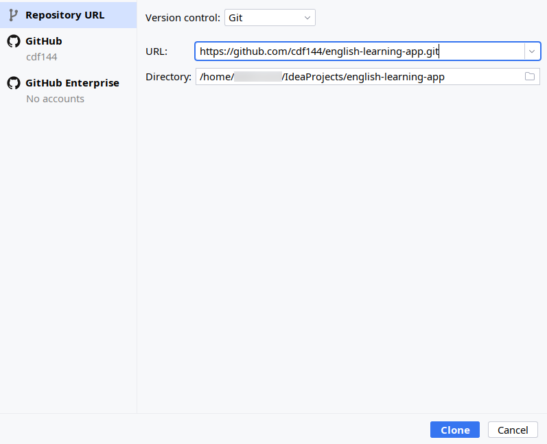
  - Wait for the cloning process to complete, then click on the project to open
  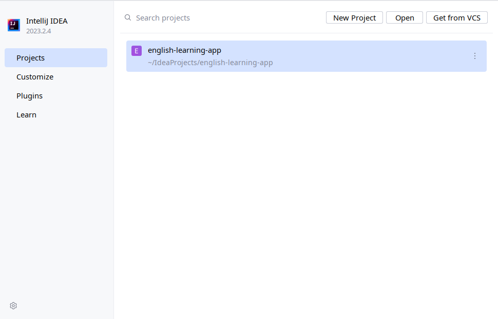
  - Wait for IntelliJ IDEA's processing to complete, then open the _Project Structure_ window by clicking on _File > Project Structure_ or press _Ctrl + Alt + Shift + S_. In the window, click on _SDK_ field and select any Java 21 JDK. If no SDK is available on your machine, click _Add SDK > Download JDK_ and then download any Java 21 JDK. When all is done, click _OK_
  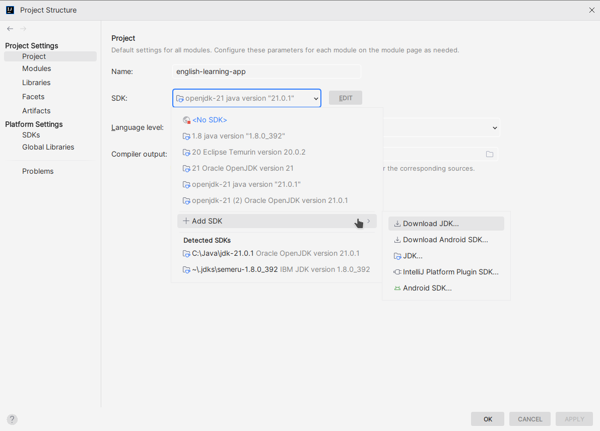
  - Open Maven tab in the top right corner and click _Reload All Maven Projects_
  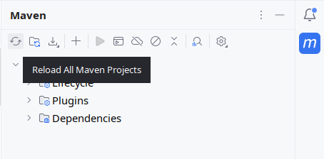
- With the development environment set-up, Build and Run the project using the pre-configured Run configurations. There are 2 versions of the app, a *Command Line* version (_DictionaryCommandline_) and a *GUI* version (_DictionaryApplication_)  
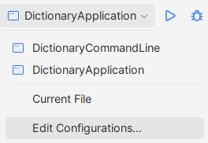

### 3. Preview

  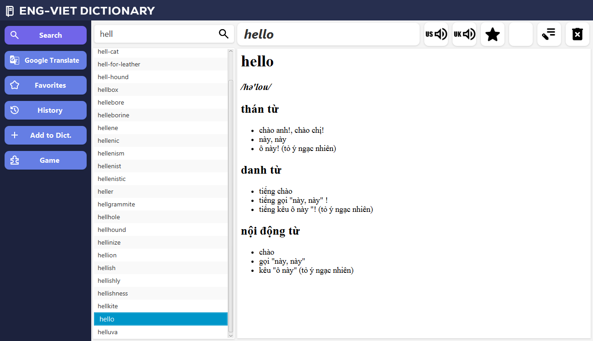
  
  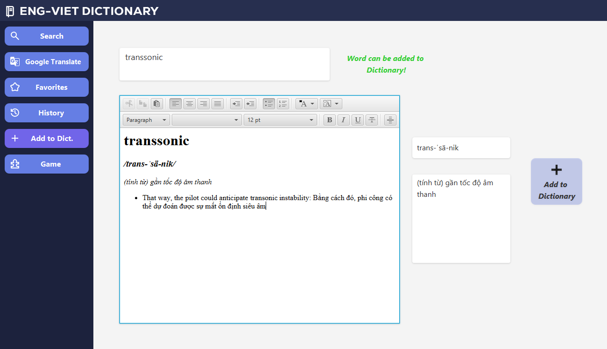

  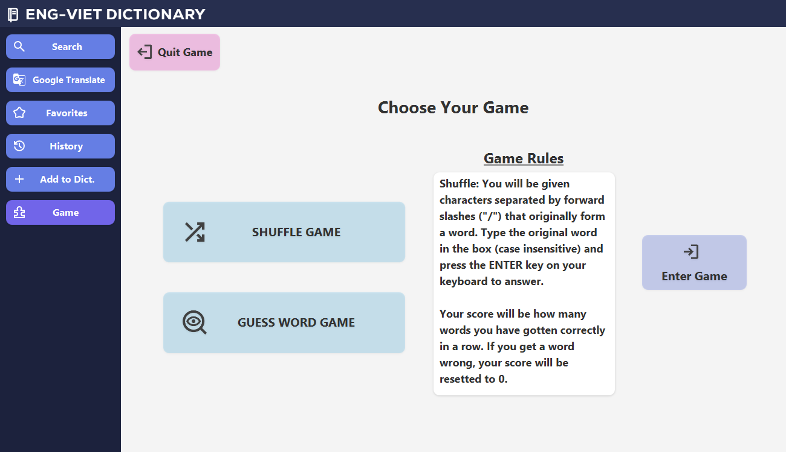
  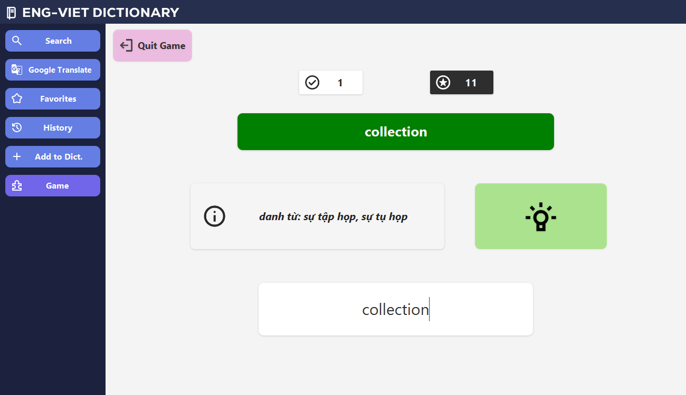
  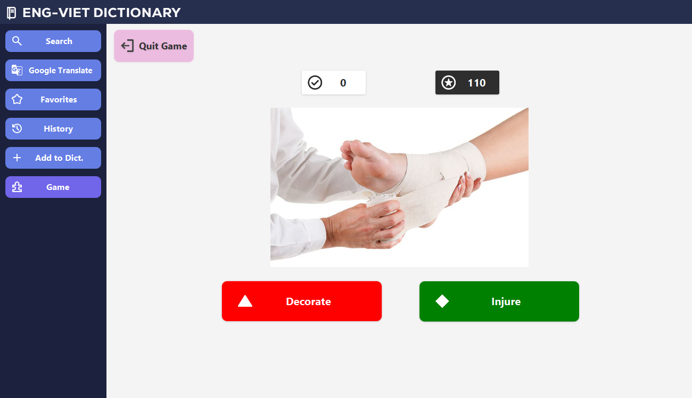

## III. CONTACT US

We hope this application will be useful to you and help you improve your English level. Hope you enjoy it and if you
have any suggestions please contact us

| Trần Đình Phú                                           | Nguyễn Nhật Quang                                    | Nguyễn Mạnh Quân                                                                      |
|---------------------------------------------------------|------------------------------------------------------|---------------------------------------------------------------------------------------|
| 22028056                                                | 22028307                                             | 22028171                                                                              |
| Lead Front-end Developer (UX/UI, CSS Styling)           | Design advisor, Front-end Developer (JavaFX & FXMLs) | Back-end Developer (Dictionary management features, JavaFX Controllers)               |
| Project's solution architect                            | Resources (text files, databases, icons & pictures)  | Implementing Google Translate & Voice API & FreeTTS as fallback                       |
| Code cleaning & refactoring                             | Implementing Shuffle Game Core & GUI functions       | Implementing Guess Word Game Core & GUI functions                                     |
| Back-end utilities (I/O & Database connection handling) | General gameplay balancing                           | General optimizations, bug testing & fixing (Exceptions, logging, unwanted behaviors) |
| Bug fixing (Edge cases detection)                       | Application QoL improvements                         |                                                                                       |

* Contact:
  - Trần Đình Phú - 22028056@vnu.edu.vn
  - Nguyễn Nhật Quang - 22028307@vnu.edu.vn
  - Nguyễn Mạnh Quân - 22028171@vnu.edu.vn

## IV. ACKNOWLEDGEMENTS

- All icons are from [Google's Material Symbols](https://fonts.google.com/icons)
- SQLite database source taken from [yenthanh132](https://github.com/yenthanh132/avdict-database-sqlite-converter)